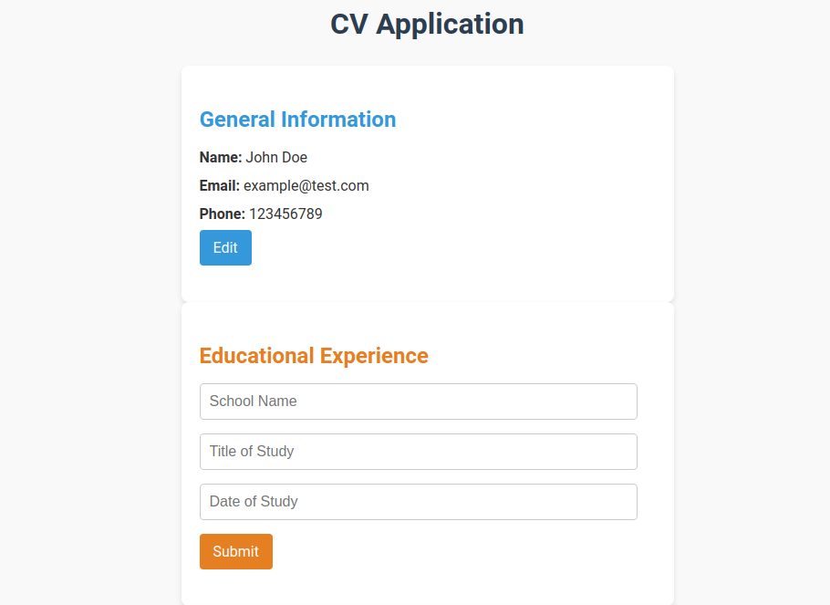
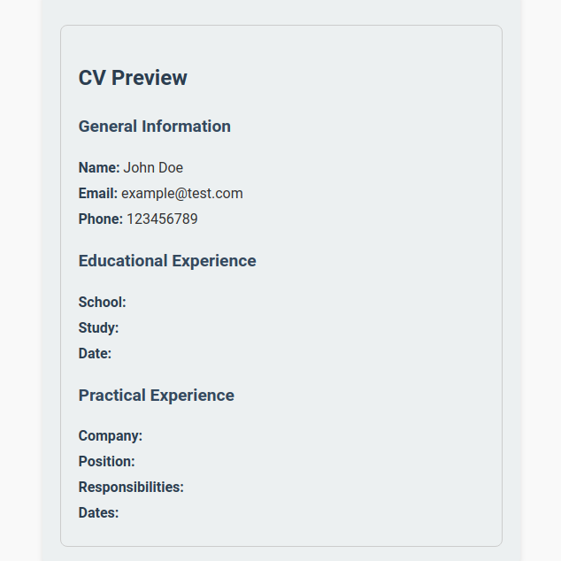

# CV Application

A simple React application where users can fill out their general information (name, email, phone), submit the form, and view their information in a clean display. Users can also edit their details after submitting. This project is perfect for beginners to learn React concepts like **components**, **state**, and **props**.

---

## Features

- **Interactive Form**: Users can input their name, email, and phone number.
- **Submit & Edit**: 
  - After submitting, the app displays the user's input in a read-only format.
  - Users can switch back to editing mode to update their details.
- **Modern Design**: Simple, responsive, and clean UI for a professional look.
- **Built with React**: Ideal for learning React basics, such as:
  - State management with `useState`.
  - Component-based architecture.
  - Passing data between components using props.

---

## Demo
Check out the live demo of the CV Application here:  
👉 **[CV Application on Netlify](https://chic-manatee-2baa3a.netlify.app/)**

---

## Screenshots

### Editing Mode

### Display Mode


---

## Getting Started

### Prerequisites

Before you begin, make sure you have the following installed:

- [Node.js](https://nodejs.org/) (Version 14 or later recommended)
- [npm](https://www.npmjs.com/) (Comes with Node.js)

### Installation

1. **Clone the repository**:
   ```bash
   git clone https://github.com/your-username/react-cv-app.git
   ```
   *(Replace `your-username` with your GitHub username)*

2. **Navigate into the project directory**:
   ```bash
   cd react-cv-app
   ```

3. **Install dependencies**:
   ```bash
   npm install
   ```

4. **Start the development server**:
   ```bash
   npm start
   ```
   This will open the app in your browser at `http://localhost:3000`.

---

## Project Structure

```
src/
├── App.js             # The main component managing the entire app
├── index.js           # Entry point for React
├── styles/            # Folder for CSS files
├── components/        # Folder for reusable React components
└── ...
```

---

## How It Works

1. **Fill Out the Form**:
   - Enter your name, email, and phone in the input fields.
2. **Submit the Form**:
   - Click "Submit" to display your information below the form.
3. **Edit Your Information**:
   - Click "Edit" to return to editing mode and update your details.

---

## Deployment

You can deploy this project to platforms like **Netlify**, **Vercel**, or **GitHub Pages**. Here’s how to deploy using GitHub Pages:

1. **Build the app**:
   ```bash
   npm run build
   ```

2. **Install GitHub Pages dependency**:
   ```bash
   npm install gh-pages --save-dev
   ```

3. **Update `package.json`**:
   Add the following lines:
   ```json
   "homepage": "https://your-username.github.io/react-cv-app",
   "scripts": {
     "predeploy": "npm run build",
     "deploy": "gh-pages -d build"
   }
   ```

4. **Deploy the app**:
   ```bash
   npm run deploy
   ```

   Your app will now be live at:  
   `https://your-username.github.io/react-cv-app`

---

## Technologies Used

- **React**: A JavaScript library for building user interfaces.
- **CSS**: Styling for a clean and modern UI.
- **JavaScript (ES6)**: For managing app logic.
